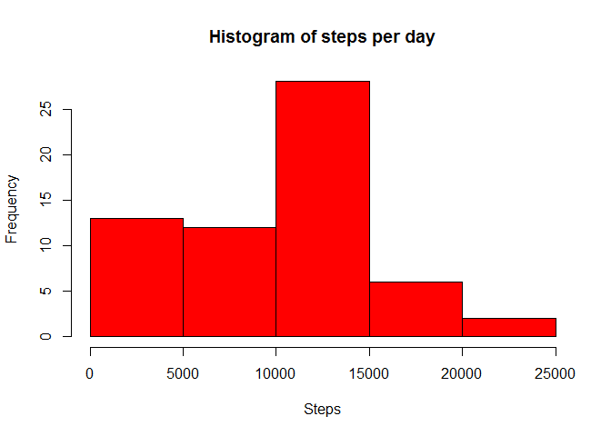
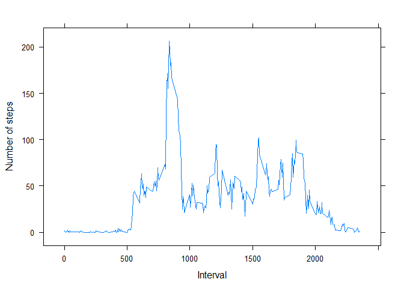
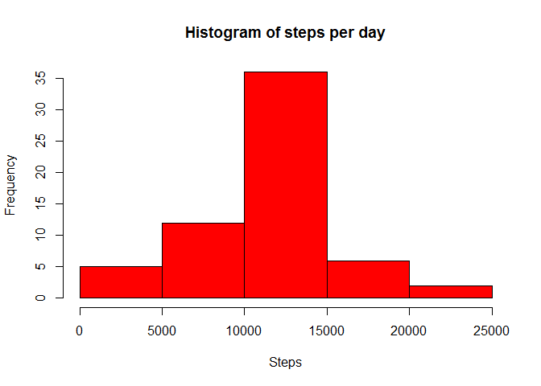
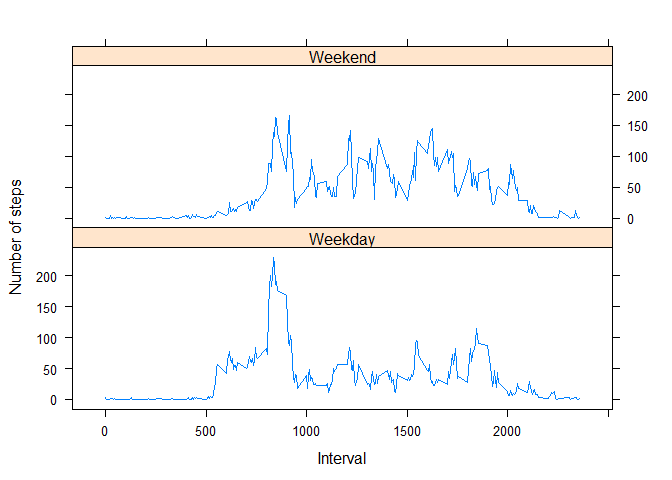

# Reproducible Research: Peer Assessment 1

## Dependent libraries

```r
library(plyr)
library(lattice)
library(knitr)
opts_chunk$set(fig.path='figure/', echo=TRUE)
```

## Loading and preprocessing the data


```r
# Read the data in using read.csv and the correct column classes
activity <- read.csv("activity.csv", colClasses=c("integer", "Date", "integer"))
```

## What is mean total number of steps taken per day?

```r
# First work out a total per day - excluding NA
steps.day <- aggregate(x=activity$steps, by=list(activity$date), 
                       FUN=sum, na.rm=TRUE)
names(steps.day) <- c("date", "steps")

# Plot a histogram of the results 
hist(steps.day$steps, col="Red", xlab="Steps", main="Histogram of steps per day")
```



Mean and median:

```r
# Work out the mean steps per day:
mean(steps.day$steps, na.rm=TRUE)
```

```
## [1] 9354.23
```

```r
# Work out the median steps per day:
median(steps.day$steps, na.rm=TRUE)
```

```
## [1] 10395
```

## What is the average daily activity pattern?

```r
# First work out the average steps per interval - excluding NA
avg.steps.int <- aggregate(x=activity$steps, by=list(activity$interval), 
                           FUN=mean, na.rm=TRUE)
names(avg.steps.int) <- c("interval", "steps")

# Plot the 'average' day
xyplot(steps~interval, data=avg.steps.int, type="l", 
       xlab="Interval", ylab="Number of steps")
```



```r
# The interval with the highest average number of steps
avg.steps.int[which.max(avg.steps.int$steps),]$interval
```

```
## [1] 835
```
8:35 - 8:40 is the five minute interval which generally has the highest number of steps.


## Imputing missing values

```r
# How many NA values are there in the data
sum(is.na(activity$steps))
```

```
## [1] 2304
```

```r
# Fill NA values with the average for that interval - based on our previous work
filled.activity <- merge(x=activity, y=avg.steps.int, by="interval")

filled.activity$steps.x[is.na(filled.activity$steps.x)] <-
  filled.activity$steps.y[is.na(filled.activity$steps.x)] 

filled.activity <- filled.activity[c("steps.x", "date", "interval")]
names(filled.activity) <- c("steps", "date", "interval")

filled.activity <- arrange(filled.activity, date, interval)

# Recompute the total steps per day with the filled values
steps.day.filled <- aggregate(x=filled.activity$steps, by=list(activity$date), 
                              FUN=sum, na.rm=TRUE)
names(steps.day.filled) <- c("date", "steps")

# Examine the histogram of the dataset with filled NA values
hist(steps.day.filled$steps, col="Red", xlab="Steps", main="Histogram of steps per day")
```



The histogram has now got a much higher peak around 10-15K steps.


```r
# Work out the mean steps per day:
mean(steps.day.filled$steps, na.rm=TRUE)
```

```
## [1] 10766.19
```

```r
# Work out the median steps per day:
median(steps.day.filled$steps, na.rm=TRUE)
```

```
## [1] 10766.19
```
Mean and median have increaded since we filled in missing values.
Note that now the mean and median are the same, this is due to our method of imputing, which has in some cases filled entire days.

## Are there differences in activity patterns between weekdays and weekends?

```r
# Add a dayType
filled.activity$dayType <- factor(ifelse(substr(weekdays(filled.activity$date),1,1) == "S", 
                                         "Weekend", "Weekday"))

# Work out the average steps per interval per day
filled.steps.int <- aggregate(x=filled.activity$steps, by=list(filled.activity$interval,
                                filled.activity$dayType), FUN=mean, na.rm=TRUE)
names(filled.steps.int) <- c("interval", "dayType", "steps")

# Plot the average steps
xyplot(steps~interval|dayType, data=filled.steps.int, type="l", layout=c(1,2), xlab="Interval", ylab="Number of steps")
```



Weekdays show a much larger morning peak, but seem to have less activity throughout the rest of the day.
